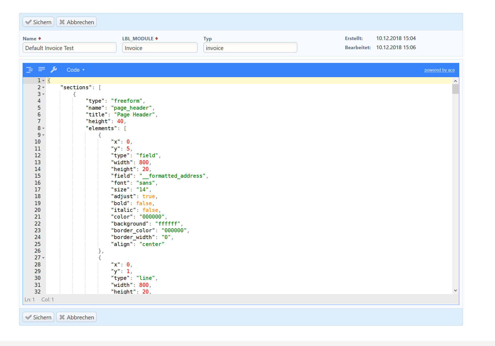

# 1crmRawTemplateEditor
A module to enable a JSON-Editor for editing PDF Templates (Expert knowledge required!)

# Warning
- If you haven't heard of JSON or do not know programming: DO NOT USE THIS MODULE! Upgrade to 1CRM Enterprise instead and use the official PDF Designer!
- If you use this module anyhow, you will be on your own with every PDF related problem in 1CRM. visual4 won't help and 1CRM corp neither!
- PDF Templates are regenerated by the maintenance methods in administration, on 1CRM updates, on module installation. Every time this happens, your changes from within this module are lost!
- there is no security measure in this module. Every 1CRM user who knows that the module can be accessed by entering index.php?module=v4RawTemplates will be able to edit your templates
- Probability is very high, that changes in PDF JSON code will make your PDF template un-usable.
- Backup, Backup, Backup!

This module adds a JSON Editor to 1CRM. With this editor, the JSON configuration for all PDF templates can be modified.

[]

This module comes without any warranty, use at your own risk! If you create great PDF Layouts, you might help others by sharing your code here (e.g. open an issue, we will publish it as an example)